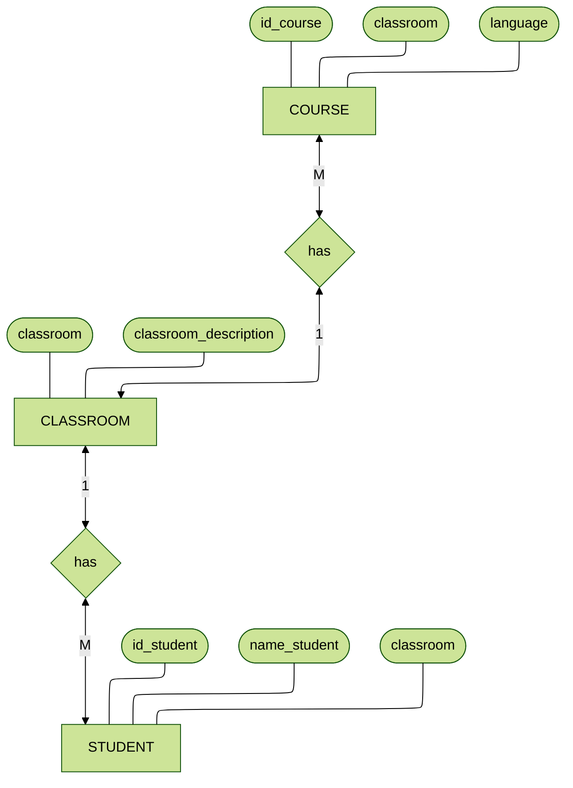
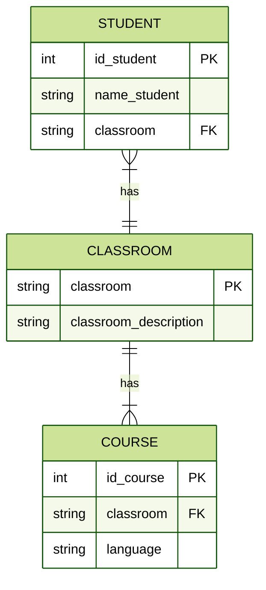

## Instrucciones:

- Descarga el pdf donde encontrarás una tabla de datos sin normalizar
- Normaliza la tabla (se recomienda el uso de Google Sheets)
- Realiza un diagrama ER de Chen
- Realiza un diagrama de tipo patas de gallo
- Crea un repositorio con el Readme
- Inserta en el Readme la descripción del ejercicio así como los diagramas creados (puedes utilizar Mermaid)

## Requisito:

- Normalizar la tabla proporcionada (ver pdf)
- Con diagrams.net realizar un diagrama de entidad-relación (de Chen)
- Con diagrams.net realizar un diagrama uml (Database Schema - Patas de gallo) de la base de datos con sus tablas, campos y relaciones

----
# Tabla normalizada

# Diagrama ER de Chen

# Diagrama tipo patas de gallo 

